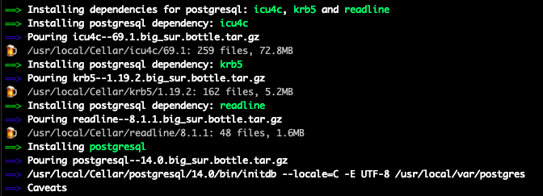

### Introducción a PostgresQL

* Primer paso

Lo primero que debemos hacer es instalar PostgresQL. Lo podemos hacer con el instalador que tengamos disponible en nuestra máquina, por ejemplo, he usado _brew_:

`brew install postgresql``

También podríamos utilizar:

`sudo apt-get install postgresql`

